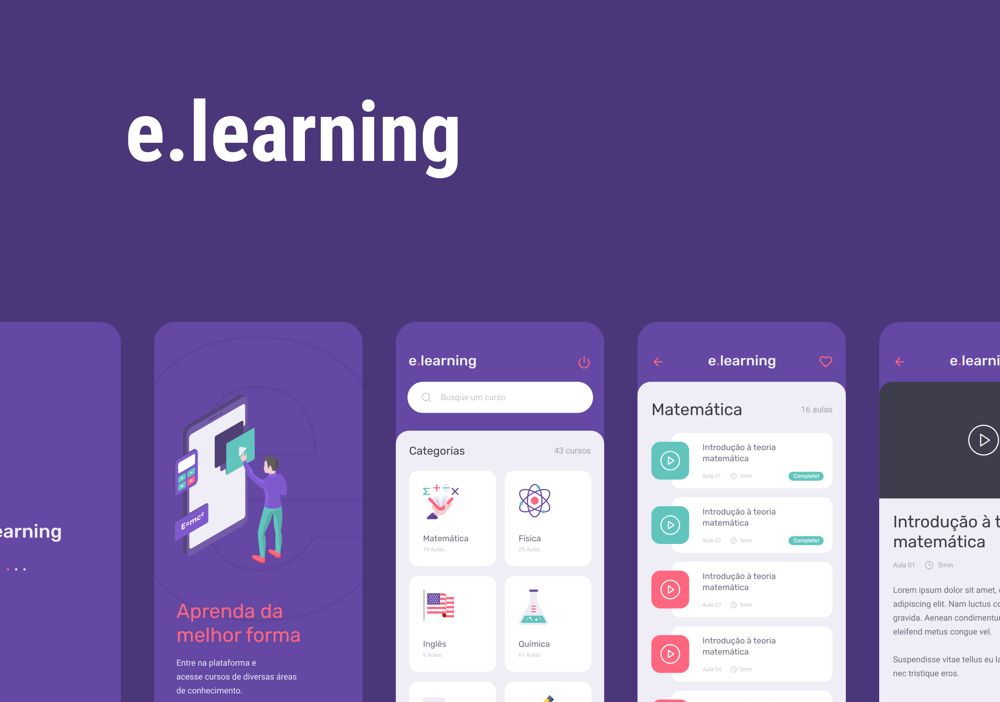

<p align="center">
  
</p>

<p align="center">
  <a href="#-tecnologias">Tecnologias</a>&nbsp;&nbsp;&nbsp;|&nbsp;&nbsp;&nbsp;
  <a href="#-projeto">Projeto</a>&nbsp;&nbsp;&nbsp;|&nbsp;&nbsp;&nbsp;
  <a href="#-como-executar">Como executar</a>&nbsp;&nbsp;&nbsp;
</p>

<h1 align="center">
    
</h1>

<br>

## 🧪 Tecnologias

Esse projeto foi desenvolvido com as seguintes tecnologias:

- [React Native](https://github.com/facebook/react-native)
- [Realm](https://github.com/realm)
- [TypeScript](https://github.com/microsoft/TypeScript)
- [Styled Components](https://github.com/styled-components/styled-components)

## 🚀 Como executar

Clone o projeto e acesse a pasta do mesmo.

```bash
$ git clone https://github.com/hugomendonca98/E_Learning_APP.git
$ cd E_Learning_APP
```

Para iniciá-lo, siga os passos abaixo:
```bash
# Instalar as dependências
$ yarn

# Iniciar o projeto
$ yarn run android
$ yarn start
```

Lembrando que será necessário usar o backend em nodejs [E_Learning_API](https://github.com/hugomendonca98/E_Learning_API)

## 💻 Projeto

A aplicação é voltada para educação, que oferece cursos de diversas áreas de conhecimento com um conteúdo em formato de vídeo aulas.

## 🔖 Layout

Você pode visualizar o layout do projeto através do link abaixo:

- [E_Learning APP](https://www.figma.com/file/C2MmctCGANJnQMDCIeqtKC/e-learning-(Copy)) 

Lembrando que você precisa ter uma conta no [Figma](http://figma.com/).
